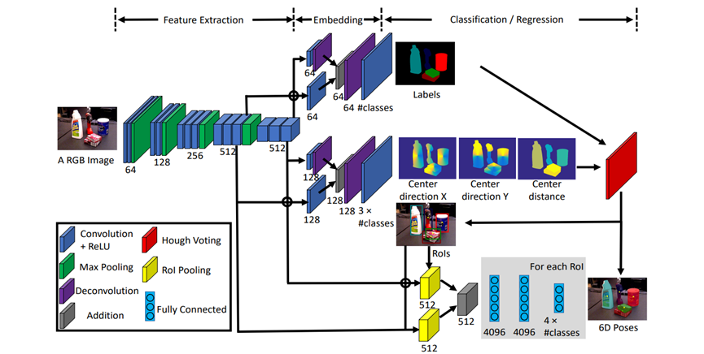

# Week 1 Work Report

## 1. Environment Setup
- Installed Ubuntu 22.04 LTS.
- Configured the development environment, including installing drivers, CUDA, and PyTorch.

## 2. Isaac Sim
- Downloaded and installed necessary software including Visual Studio Code and Omniverse.
- Successfully installed Isaac Sim.
- Completed the first part of the Isaac Sim tutorial.

## 3. CNN
### Reviewed the basic concepts of CNN
  - Only the basic concepts of PoseCNN were understood in this week, but the code was not reproduced.
- **PoseCNN**
  - Studied related PoseCNN projects.
    - [PoseCNN: A Convolutional Neural Network for 6D Object Pose Estimation in Cluttered Scenes](https://github.com/yuxng/PoseCNN)
    - [PoseCNN-PyTorch: A PyTorch Implementation of the PoseCNN Framework for 6D Object Pose Estimation](https://github.com/NVlabs/PoseCNN-PyTorch)
  - Tutorial learning: [Video Tutorial](https://www.bilibili.com/video/BV1r54y1Q7Ho/?spm_id_from=333.337.search-card.all.click&vd_source=26624f082cfd70a54f6c219c28209c17)
  - 
  
- **PointNet(++)**
  - Project research:
    - [PointNet and PointNet++ PyTorch Implementation](https://github.com/yanx27/Pointnet_Pointnet2_pytorch)
  - Tutorial learning: [Video Tutorial](https://www.youtube.com/watch?v=hgtvli571_U)

### Data Collection
- Not started yet

## Difficulties
- This week was short, and a considerable amount of time was spent on environment setup.
- Attempted to install Isaac Sim using a virtual machine but failed due to hardware limitations. Later purchased an SSD and configured Ubuntu.
- There are few projects related to PoseCNN on GitHub.
