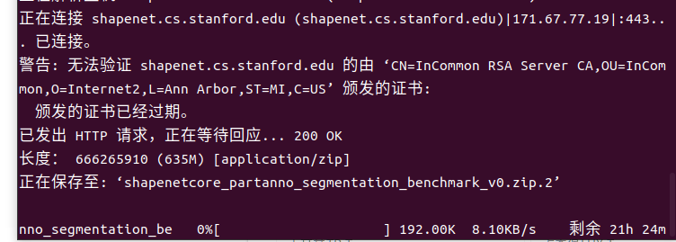
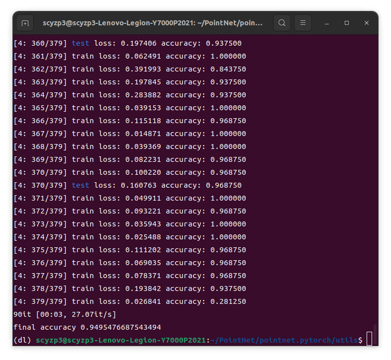
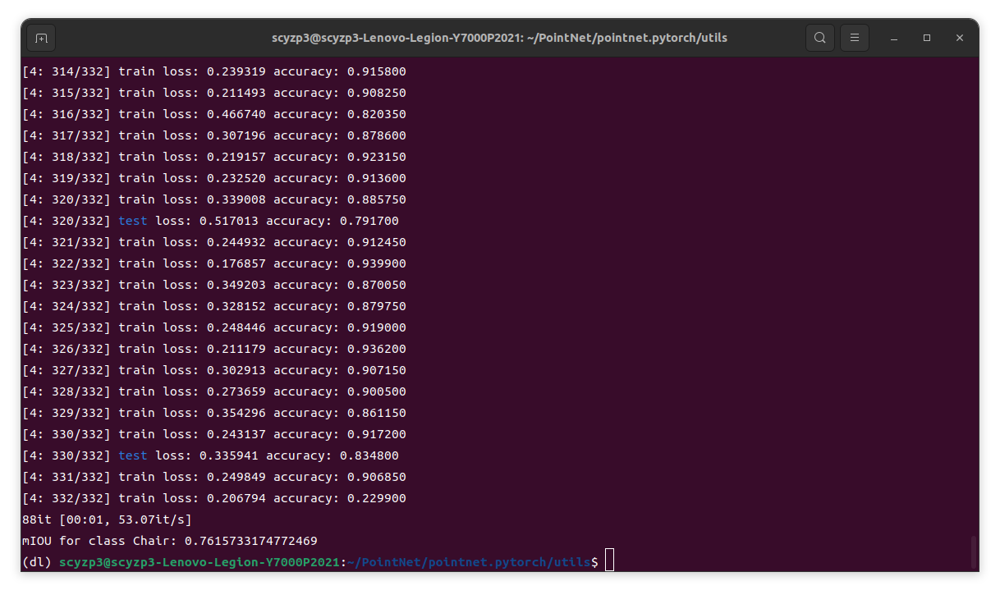
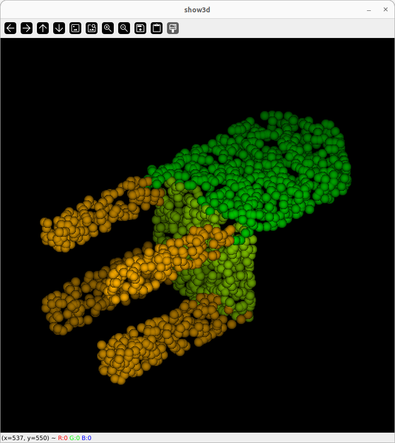
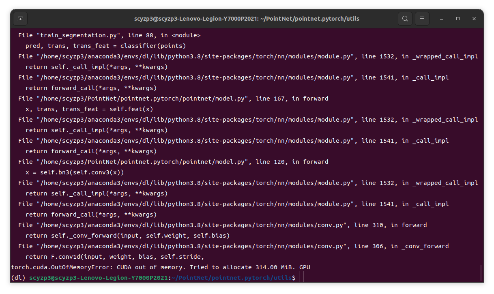

# Week 2 Work Report

## Overall
- Completed the reproduction of PointNet.
- Attempted to reproduce PoseCNN.

## PointNet
- Dataset: shapenetcore_partanno_segmentation_benchmark_v0
- Issues encountered: Slow download speed.
- Solution: Searched for alternative sources.

- Classification training

- Segmentation training

- Issues encountered: Insufficient GPU memory.
- Solution: Reduced batch size, but accuracy decreased.

## PoseCNN
- Reproduction not completed.
- Issue 1: Dataset is too large and downloads slowly.
- Contains C++ components, causing errors with CPython.

## Next Week Plan
- Resolve PoseCNN issues.
- Attempt to use an alternative dataset.
