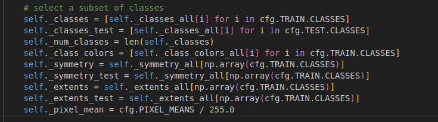
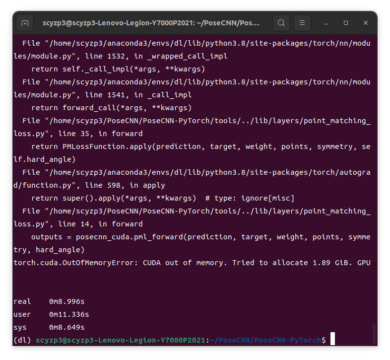

# Week 3 Work Report

## Overall
- Completed debugging of the PoseCNN project
- Studied PointNet++

## PoseCNN
- The project is outdated, and many dependencies have undergone multiple updates, resulting in incompatibility between higher and lower versions.
- There are version dependencies for numpy, opencv, and matplotlib.
- The versions of numpy, THC, and yaml are too high, requiring function modifications or downgrades.
- The use of float64/32 has been deprecated.
- Replaced THCudaCheck with AT_CUDA_CHECK.
- Used the numpy library to avoid this error: `IndexError: too many indices for array: array is 2-dimensional, but 21 were indexed`.
- 
- Many datasets are missing (links in the project are broken).
- Insufficient GPU memory.
- 

## PointNet++
- Reading the paper
- [PointNet++](https://krmzyc-filecloud.oss-cn-beijing.aliyuncs.com/theory/Qi%20et%20al_2017_PointNet%2B%2B.pdf)

## Next Week Plan
- Use Docker to run PoseCNN on the host machine.
- Complete the paper reading and reproduce PointNet++.
