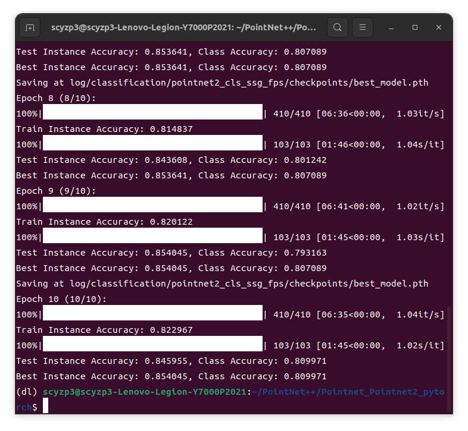
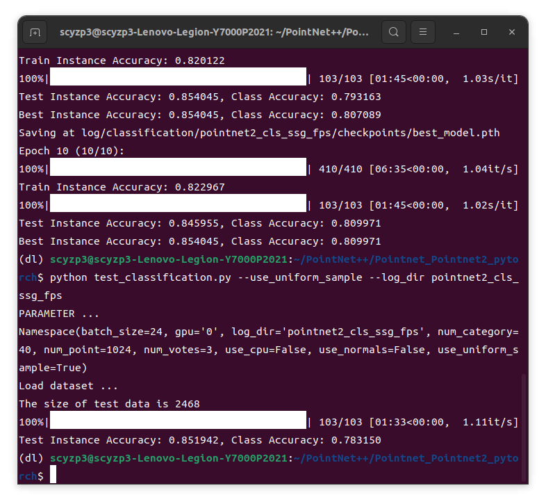
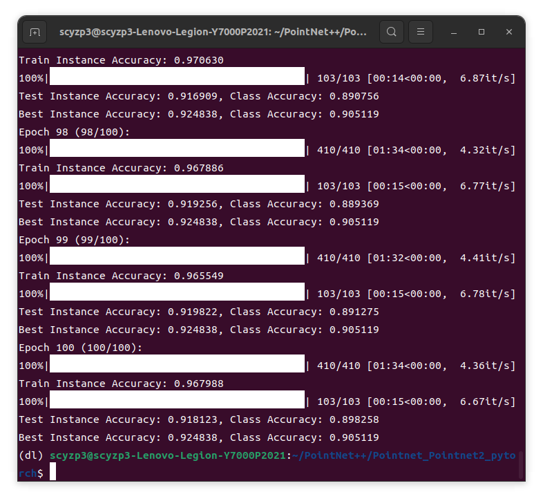
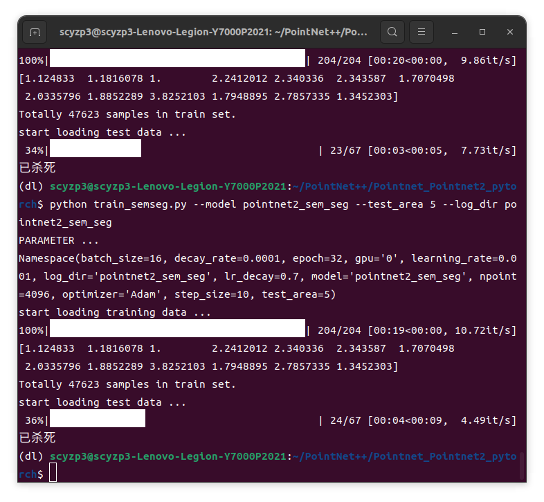

# Week 4 Work Report

## Overall
- Completed PointNet++ reproduction
- Learned Docker

## PointNet++
- Reading the paper
  - [PointNet++](https://krmzyc-filecloud.oss-cn-beijing.aliyuncs.com/theory/Qi%20et%20al_2017_PointNet%2B%2B.pdf)
- Reproduction project: [PointNet and PointNet++ PyTorch Implementation](https://github.com/yanx27/Pointnet_Pointnet2_pytorch)
- PointNet++ classification
  - 10 epoch results:
    - 
    - 
  - 100 epoch results:
    - 
- PointNet++ segmentation
  - Insufficient GPU memory
    - 

## Next Week Plan
- Deploy posecnn and PointNet to the host
