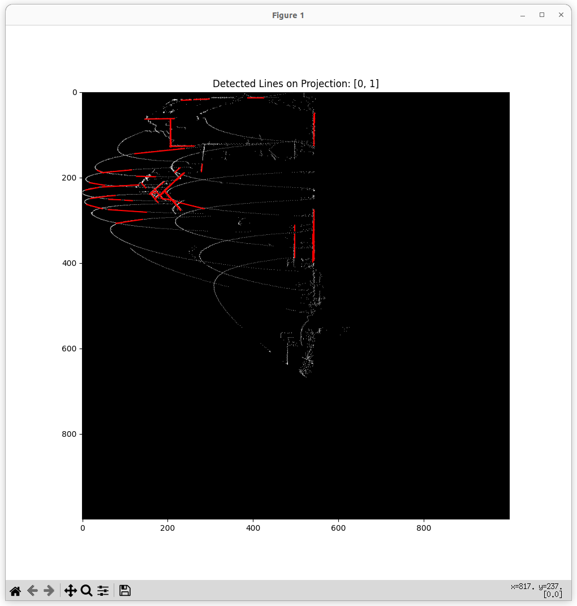
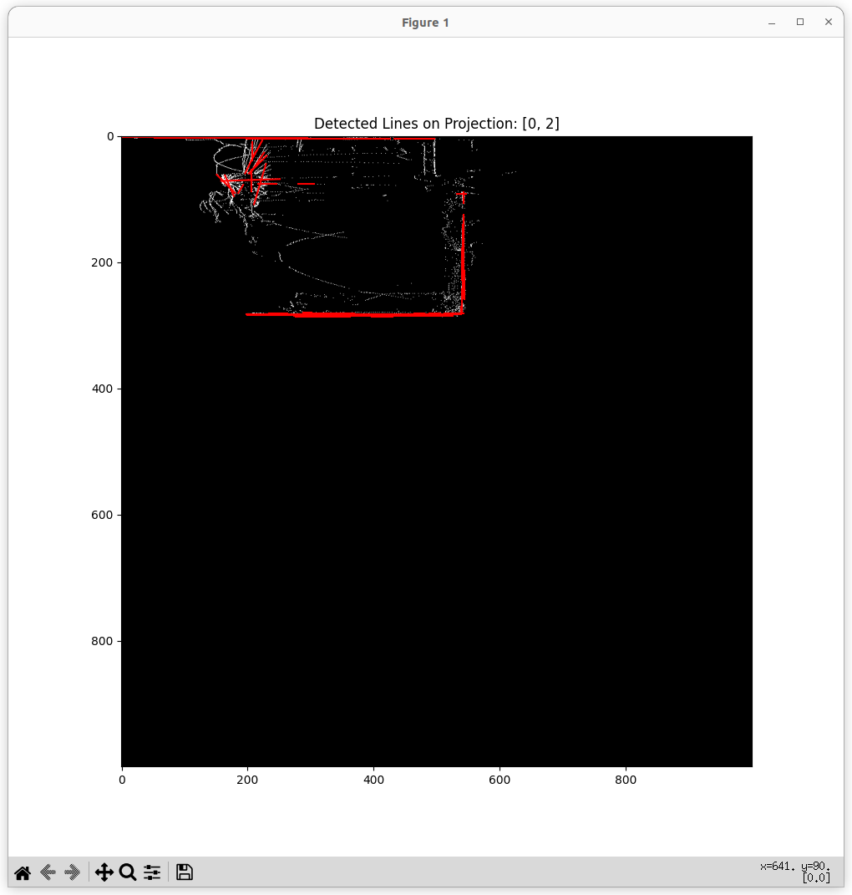
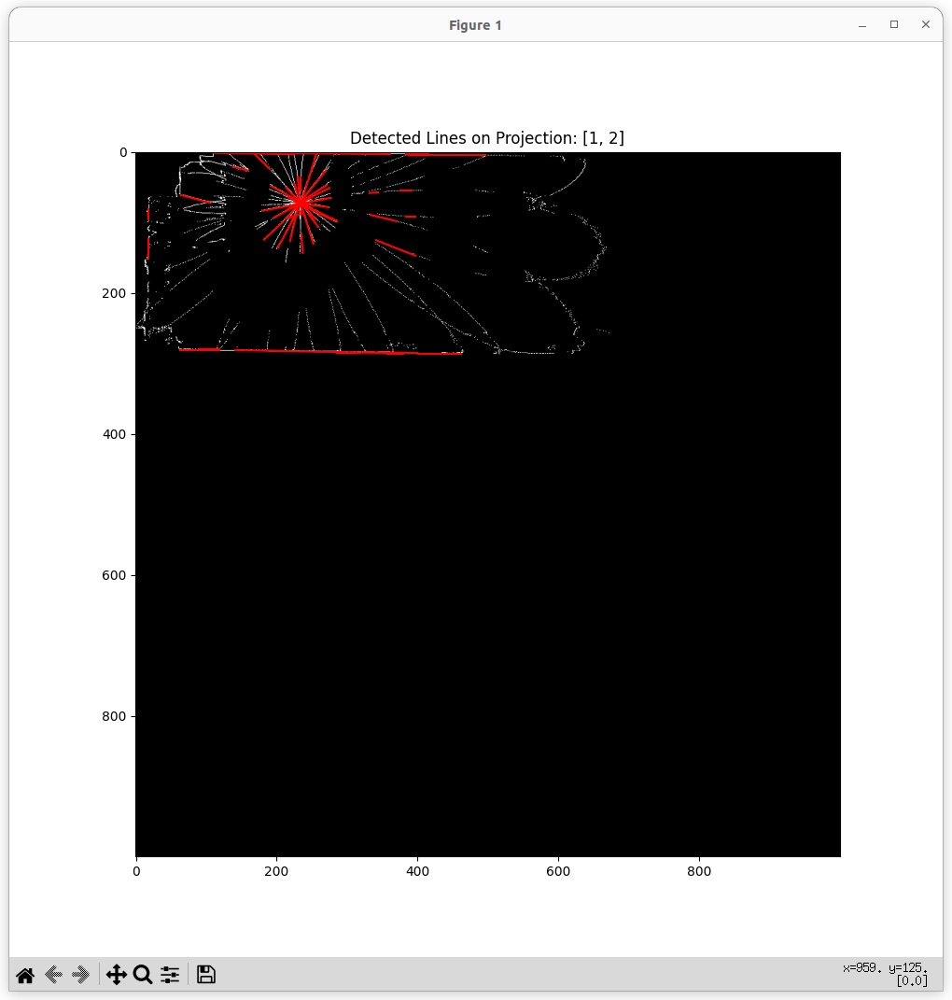

# Week 5 Work Report

## Overall
- Processed data, extracted lines and planes using PCA and scatter plots.

## PCA
- Dimensionality reduction algorithm, feature extraction.
- Utilized the PCA API from the sklearn library.

## Hough
- Steps:
    - Data processing and noise reduction.
    - Define the region of interest (ROI).
    - Projected point cloud onto planes (using xy, xz, and yz planes).
    - Applied Hough Transform.
- 
- 
- 

## Problem
- Unable to remove the rose line produced by Livox LiDAR data collection.
- Difficulty in determining the ROI.
- Difficulty in deciding the projection plane.
